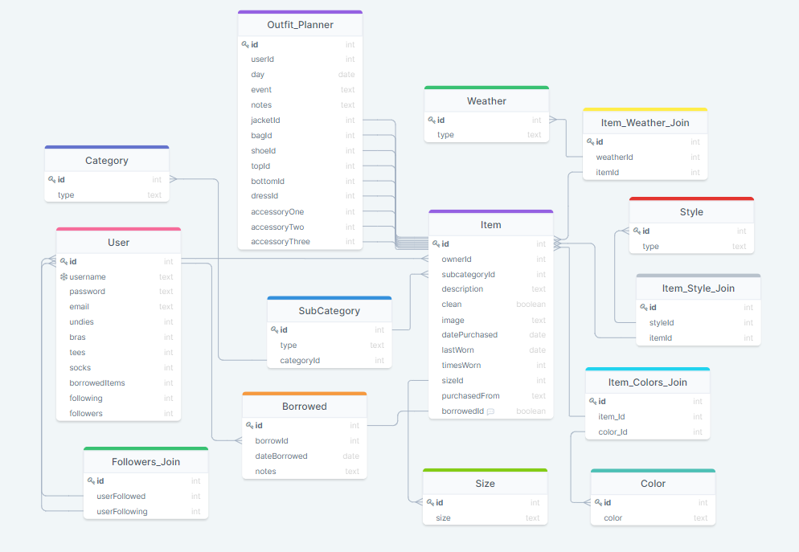

#  Closet to Ensemble or C2E
 [Closet To Ensemble](https://closettoensemble.herokuapp.com/)

## Table of Content

-  [Description](https://github.com/dev-kagant/Closet2Ensemble#Description)
-  [Using Closet to Ensemble](https://github.com/dev-kagant/Closet2Ensemble#Using-the-application)
-  [Technologies Used](https://github.com/dev-kagant/Closet2Ensemble#Technologies)
-  [React Components](https://github.com/dev-kagant/Closet2Ensemble#React-Components-List)
-  [Frontend](https://github.com/dev-kagant/Closet2Ensemble#Frontend)
-  [Backend](https://github.com/dev-kagant/Closet2Ensemble#Backend)

## Description
Closet to Ensemble is a virtual closet app that allows its user to track items within their individual closets. It also allows users to follow their friends and family members closets, share clothes. As well as track items usage, how often they actually wear each item of clothing, and eventually being able sell them on the thrift shop.

##  Using the application
* Login - Everyone is required to login to access this application
* Once logged in users can:
	* Add items to their closets
	* Remove items from their closets
	* View an item within the closet
	* Search through they items they have in their closets
* Log out of the system or it can remember the user for the next time

##  Technologies

* Javascript (https://developer.mozilla.org/en-US/docs/Web/JavaScript)
* Python (https://docs.python.org/3/)
* React for the frontend (https://reactjs.org/docs/getting-started.html)
* Flask for the backend (https://flask.palletsprojects.com/en/1.1.x/)
* Redux to help manage the state of the application (https://redux.js.org/introduction/getting-started)
* React-redux to connect my react components with the redux store (https://redux-toolkit.js.org/introduction/quick-start)
* Redux-logger only for development (https://www.npmjs.com/package/redux-logger)
* Redux-thunk to apply middleware throughout the application (https://www.npmjs.com/package/redux-thunk)
* Pip Datetime (https://pypi.org/project/DateTime/) (https://realpython.com/python-datetime/)

## React Components List
* NavBar
* Modal
* C2EAccess
	* Login and SignUp

* Closet
* Items
	* Category Display

	* Item Display
	* New Item
* Footer

## Frontend
Built using React which allowed for easy rendering of information on pages without requiring a full page reload, this came in handy when rendering the many Modals with in the site, it also allowed for reusing components on different page templates. Redux was also used to help keep the state so that different aspects of it could be used on different pages.

## Backend
The backend was built using Python, Flask, PostgreSQL. This allow for data smooth data management. Building multiple tables with relationsional connects to each other, meant that data could be obtain by fetching just one table.

## Database Schema

